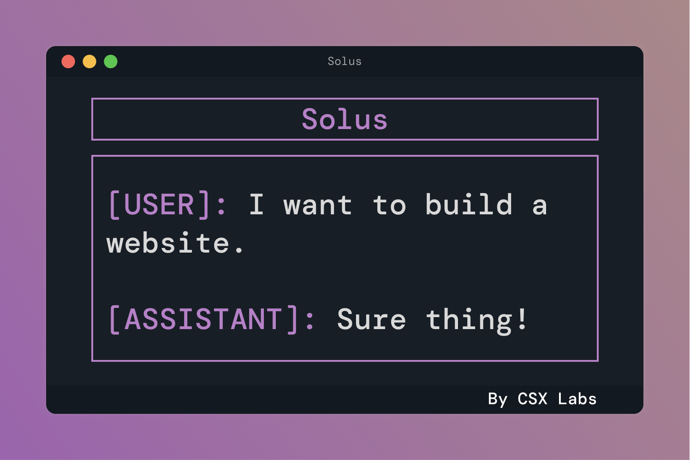
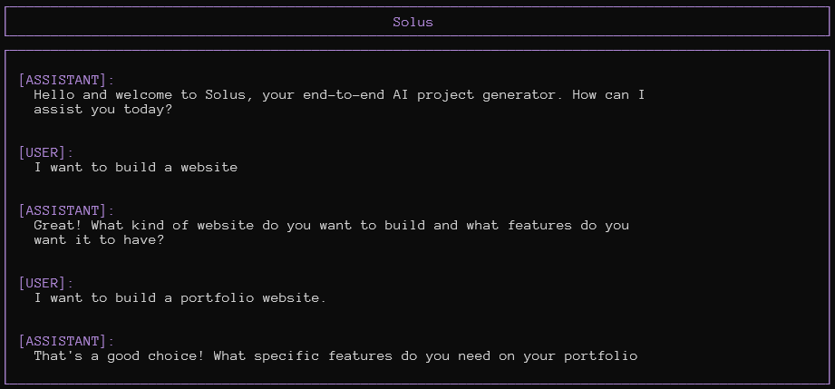

# Solus

An `AI-assisted` project generator.

## Table of Contents

- [Solus](#solus)
  - [Table of Contents](#table-of-contents)
  - [Mission](#mission)
  - [Resources](#resources)
  - [Overview](#overview)
  - [Why?](#why)
  - [Requirements](#requirements)
    - [Chat](#chat)
    - [Querying (Query API)](#querying-query-api)
    - [Project Planning](#project-planning)
    - [Coding \& Debugging](#coding--debugging)
    - [Context Engine](#context-engine)
  - [Current Status](#current-status)
    - [Task List](#task-list)

## Mission

To automate the process of creating a project from requirements.

## Resources

For a more in-depth breakdown of the requirements and components, see our [specification](SPECIFICATION.md).

Interested in contributing or testing this project? Check out our [contributing guide](CONTRIBUTING.md).

All of our submitted external proposals are in the [proposals](proposals/) folder.

**Proposal Updates:** We just submitted a [proposal](assets/proposals/google_cloud.pdf) to [Google Cloud's Research Credits program](https://edu.google.com/intl/ALL_us/programs/credits/research/)
for cloud credits, or money we can use towards Google Cloud services. We also reached out to OpenAI (no full proposal, just an email) and Microsoft to see if they could grant us cloud credits. We reached out to many independent funding sources, if we end up solidifying a deal we'll let you know.

## Overview

Solus aims to bridge gaps between AI and humans in software development by allowing language models to interface with the internet and filesystem, opening their contributions to developers on a wider scale. While Solus codes and debugs, developers can focus on higher-level tasks like architecture, design, and requirements. Solus will be able to generate an entire project from a conversation with the developer.

## Why?

There aren’t any _complete_ AI project generators. Current AI-assisted software development services, such as [GitHub Copilot](https://github.com/features/copilot) and [Replit’s Ghostwriter](https://replit.com/site/ghostwriter), are limited by their lack of access to external contexts like online documentation, a debugger, or library updates outside their training data. This lack of sufficient context limits these services to assistants rather than complete development solutions.

## Requirements

**Vision:** A CLI tool that can generate an end-to-end project from well-defined
requirements.

### Chat

Solus will chat with the developer, gathering requirements for the project and using its query functionality to get outside information. There are already readily-available chat-based language models, like OpenAI’s [gpt-3.5-turbo](https://openai.com/blog/introducing-chatgpt-and-whisper-apis) and [gpt-4](https://openai.com/research/gpt-4), that we can use for the developer to converse with the user.

### Querying (Query API)

1. A language model generates a JSON query and sends it to the Query API.
2. Solus will integrate with search APIs, such as [Google Custom Search](https://developers.google.com/custom-search/v1/introduction), and other essential websites, such as [StackOverflow](https://stackoverflow.com/), to gather a corpus of information about a query. We’ll integrate with some common websites and databases to remove overhead from scraping. However, we will provide scraping functionality (of returned search results), so Solus can access external documentation, API specifications, and other requisite information.
3. Solus will then use a language model to scan over the corpus and distill information relevant to the query. In the future, we plan to implement search methods to pre-align the language model with the important parts of the pages, as large language models are latent and compute-expensive.
4. Solus will serialize the distilled information into a JSON response and send it to the requestee.

### Project Planning

1. Solus will generate and revise project outlines and requirements in YAML from the chat conversations and queried contexts.
2. Solus will use this outline to generate and revise the project's folder and file structure. Solus will apply the project structure to the file system.
3. Solus will also take the project requirements and use the Query API to get dependency information.

### Coding & Debugging

- Solus will utilize language models to generate the code, requesting context from a context engine and outside information from the Query API.
- There will be continuous refactoring throughout the development process. We will start with regenerating the entire file to refactor, though we plan to integrate in-place editing functionality in the future.
- Solus’ language models will have access to a Debugging API, allowing them to interface with a debugger and fix errors.

### Context Engine

- Solus’ context engine will enable a language model to search the entire codebase and add items to its context. Solus passes in context at the beginning of any prompt given to the model.
- We will start rudimentary with simple text concatenation, though we plan to include search functionality and advanced context management features in the future.

## Current Status

We are still building the MVP. We finished the interface (shown below), added chat functionality, and integrated with different outside data sources. The querying functionality is currently limited to Google search results, though this will change as we iterate on the Query API.

### Task List

This task list is for the Minimum Viable Product (MVP) of Solus. The MVP will
meet the bare minimum of the requirements listed above and in the specification.
The tasks are being completed according to the [Tracer Bullet Philosophy](https://wiki.c2.com/?TracerBullets)
presented in _[The Pragmatic Programmer](https://dl.acm.org/doi/10.5555/320326)_.
The idea is that we will try to slice through the different parts of the project
to provide a simple set of presentable features that can we can continue to
build upon.

Please check our our GitHub [Project Page](https://github.com/orgs/CSXL/projects/2) for the task list and roadmap.
